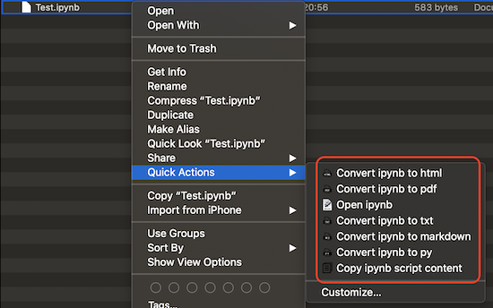
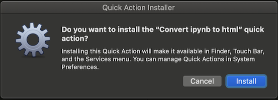

# FastJN

This repository contains some **Mac OS** Automator scripts making your life with Jupyter notebook much more efficient.
## How to use
  
Right-click on a `ipynb` file, you will see some scripts installed in Quick Actions part.

## Content

| Script Name   |     Comment       | Note  |
| ------------- |:-------------:| -----:|
| Open ipynb     | Open selected file in Jupyter notebook | Notice |
| Convert to FORMAT | Convert selected file to target format.| Supported Formats: `md`, `html`, `py`, `pdf`, `txt` |
| Copy ipynb script | Copy selected file script content to clipboard | The content is same the converted `py` file |

## Install

Download or clone this repository, you will find those weird folder-like files in **Scripts** folder are actually Automator scripts.  

Double-click on the script and click “install” button on the pop-up alert. it will automatically installed and a system preference window might show up to allow you to manage the actions. Just close it if you don’t want to do any further customization.

  

For example, if you installed _Open ipynb_, right-click on any “.ipynb” file, you will find “Open ipynb” in the “Quick Actions”.

All done👏.

> Those quick actions installed can be accessed by right-clicking menu on all types of files in Finder. So don’t do it on wrong file types or you will see an error.

## Notice
1. Open ipynb
With this script installed, you can open any `ipynb` file by simply right-clicking file and selecting this item in the “Quick Actions”.

This action will open a new Terminal window that is running Jupyter notebook. So you need to manually close Jupyter notebook session with either of the following options when finished editing.   

- **Option1**  
Select the terminal window and press `Control+C` to end the session and `CMD+Q` to quit the terminal.  

- **Option2**   
Select the terminal window and press `CMD+Q` and then click on `Terminate Process` button on popup alert.

2. Convert to pdf
This action will convert your `ipynb` to a pdf file. 
The new file wiil be in the same folder as your `ipynb` file.

> This script need package `pandoc`.  
Run `pip install pandoc` in your terminal if you see an error complaining `pandoc` not found.

